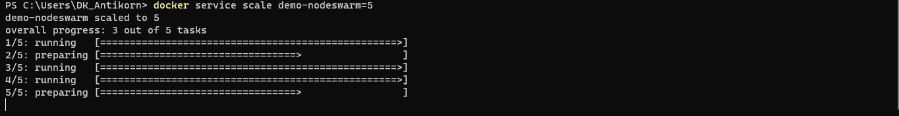

## Init for nodejs demo swarm project
- npm init -y
- npm install express
- touch app.js
- node app.js

## Create Image
- docker build -t nodeswarm:1.0 .

## Create Docker Container (Standalone)
- docker run -d -p 3000:3000 --name nodeswarm nodeswarm:1.0
- curl http://localhost:3000

## Create Docker Swarm as Cluster
- docker swarm init
- docker service create --replicas 3 --name demo-nodeswarm --publish 3000:3000 nodeswarm:1.0
- curl http://localhost:3000

## Create swarm with docker-compose file
- docker stack deploy -c docker-compose.yml <container_name>
- docker stack deploy -c docker-compose.yml nodeswarm:1.0

## Remove swarm node / swarm manager
- docker swarm leave --force
- docker node ls

## Docker command
- docker images
- docker rmi <image_id>
- docker ps 
- docker rm <container_id>
- docker service ls
- docker service rm <service_id>

## Docker Build Image

## Docker run single instance

## Docker run swarm cluster

## docker list all service

